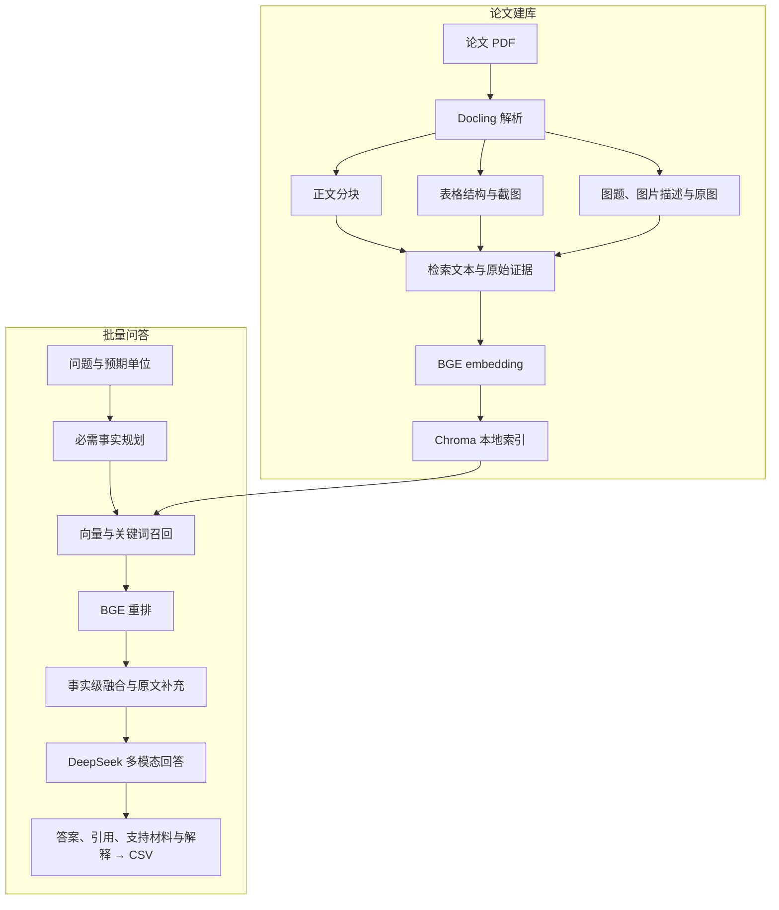

# WattBot 2026：多模态 RAG 参赛方案

本项目面向 [Kaggle WattBot 2026](https://www.kaggle.com/competitions/WattBot2026/overview)，从指定论文与报告的正文、表格和图表中检索证据，生成包含答案值、引用、支持材料和解释的提交 CSV。

## 比赛背景

WattBot 2026 关注人工智能的能源消耗、用水、碳排放及其他环境影响。参赛系统需要回答直接事实、图表读数、数学推导、跨文献组合和冲突消解等问题；语料不足以支持答案时，应明确拒答。任务介绍见 [UW–Madison 官方项目页](https://uw-madison-datascience.github.io/ML-X-Nexus/Projects/ML-Marathon/WattBot-2026.html)。

当前使用的数据包包含 122 份文献索引、245 道训练题和 317 道测试题。仓库 `input/` 中的文件由比赛提供，来源为 [WattBot 2026 官方数据页面](https://www.kaggle.com/competitions/WattBot2026/data)。文献由 `metadata.csv` 给出下载链接，参赛者需要准备对应 PDF。

比赛采用 0～1 的 WattBot Score：

| 评分项 | 权重 | 关注内容 |
|---|---:|---|
| `answer_value` | 75% | 数值、类别或不可回答状态是否正确 |
| `ref_id` | 20% | 支持文献集合与标准引用集合的 F1 |
| `is_NA` | 5% | 不可回答题是否正确拒答并清空证据字段 |

数值答案通常按 ±0.1% 相对容差判断，部分题目有单独的容忍范围；具体规则以数据包中的官方 `Score.py` 为准。`answer_unit` 由问题文件提供，不单独计分。不可回答时，`answer_value`、`ref_id`、`ref_url` 和 `supporting_materials` 使用 `is_blank`。

## 项目架构

项目由论文建库和批量问答两条流程组成。正文、表格文本与图片描述使用同一个文本索引；检索命中后，再取回完整表格、原图及相关原文供大模型回答。



当前组件：

| 环节 | 实现 |
|---|---|
| PDF 解析 | Docling，保留正文、表格结构和图片 |
| 文本向量 | `BAAI/bge-small-en-v1.5` |
| 索引与关键词检索 | Chroma 本地持久化索引及 FTS5 |
| 重排 | `BAAI/bge-reranker-base` |
| 图片描述、事实规划与回答 | 默认 DeepSeek `deepseek-flash`，可切换 MiMo `mimo-v2.6-flash` |
| 提交生成 | 批量预测、进度恢复和 CSV 导出 |

核心代码位于 `src/wattbot/`：`ingest.py` 负责解析，`index.py` 负责建库，`retrieve.py` 负责检索，`generate.py` 负责问答与输出，`models.py` 管理模型和路径。两个运行入口位于 `scripts/`。

## 方案作用

项目将逐篇查找文献、整理证据和填写答案的过程串成可重复运行的流程，用于完成比赛提交，也可通过自定义问题文件查询同一文献集。

比赛要求把答案与指定文献中的证据对应起来。检索提供可追溯的来源，多模态输入帮助读取正文解析无法完整表达的图表信息，结构化输出则将结果转换为比赛需要的字段。

| 比赛需求 | 项目做法与作用 |
|---|---|
| 证据分散在正文、表格和图片中 | Docling 保留文档结构；图表通过文本表示参与检索，命中后提供原图，便于读取表头、图例和数值 |
| 问题同时包含语义描述与精确型号、术语 | 向量检索覆盖语义相近内容，关键词检索补充名称和短语匹配，降低单一召回方式的遗漏风险 |
| 跨文献问题需要多个事实 | 先规划必需事实，再分别检索并融合证据，使不同操作数或来源都有机会进入回答上下文 |
| 召回内容多，相关程度不同 | BGE 重排与证据去重集中保留相关材料，减少重复上下文 |
| 答案需要可核查的引用和解释 | 保存原始证据、页码和来源映射，将支持材料及推理写入提交文件 |
| 整批预测需要稳定完成 | 本地模型和索引复用，逐题保存进度，支持中断后继续 |

这套方案将文献整理、证据查找和提交生成串成可运行的流程，也便于检查答案所依据的原文和图表。

## 运行方法

### 1. 安装环境

需要 Python 3.14 或以上版本、uv，以及可被 PyTorch 识别的 NVIDIA CUDA GPU。以下命令以 Windows PowerShell 为例：

```powershell
git clone https://github.com/DeianHsu/WattBot.git
cd WattBot
uv sync
.venv\Scripts\Activate.ps1
python -c "import torch; print(torch.__version__, torch.cuda.is_available())"
```

最后一条命令应显示 CUDA 可用，即 `True`。Windows 环境按项目配置安装 CUDA 13.0 版 PyTorch；embedding 和重排在本地 GPU 上运行。

### 2. 配置大模型 API

首次使用时复制配置模板：

```powershell
Copy-Item .env.example .env
```

项目默认使用 DeepSeek，并关闭思考模式。编辑 `.env`，填写 `DEEPSEEK_API_KEY`：

```dotenv
LLM_PROVIDER=deepseek
ANSWER_REASONING_EFFORT=off
MIMO_API_KEY=
DEEPSEEK_API_KEY=你的密钥
```

`ANSWER_REASONING_EFFORT=off` 保持关闭思考。使用 MiMo 时，将 `LLM_PROVIDER` 设为 `mimo`，填写 `MIMO_API_KEY`。图片描述、异常表格转写、事实规划和问答会调用所选 API。

### 3. 准备比赛数据与论文

仓库已包含比赛提供的 `input/` 文件，可直接使用。文件来源及更新见 [WattBot 2026 官方数据页面](https://www.kaggle.com/competitions/WattBot2026/data)：

| 文件 | 用途 |
|---|---|
| `metadata.csv` | 文献 ID、元数据及固定下载 URL |
| `test_Q.csv` | 测试问题和预期答案单位 |
| `train_QA.csv` | 带答案、引用和证据的训练示例 |
| `Score.py` | 比赛提供的官方评分实现 |
| `CONTRIBUTE_QUESTIONS.md` | 官方问题贡献说明 |
| `WRITEUP_TEMPLATE.md` | 官方参赛报告模板 |

另行按 `metadata.csv` 的固定 URL 下载论文，保留指定版本，并以 `<id>.pdf` 命名。

本地目录示例：

```text
WattBot/
├─ input/
│  ├─ metadata.csv
│  ├─ test_Q.csv
│  ├─ train_QA.csv
│  ├─ Score.py
│  ├─ CONTRIBUTE_QUESTIONS.md
│  └─ WRITEUP_TEMPLATE.md
├─ papers/
│  └─ <metadata 中的 id>.pdf
├─ scripts/
├─ src/wattbot/
├─ .env
├─ pyproject.toml
└─ uv.lock
```

论文、密钥、索引和生成结果需在本地准备或生成。

### 4. 建立索引

```powershell
# 处理 papers/ 中的全部 PDF
python scripts/build_index.py

# 只处理一篇论文
python scripts/build_index.py --pdf "papers/实际论文文件名.pdf"
```

首次运行会下载所需本地模型。向量索引写入 `chroma_db/`，图片和描述缓存写入 `artifacts/`；重新处理单篇论文会替换该论文的索引记录。

### 5. 生成并提交答案

```powershell
python scripts/predict.py
```

默认读取 `input/test_Q.csv` 和 `input/metadata.csv`，输出 `submissions/test_submission.csv`，完成后可将该 CSV 提交到 Kaggle。

输出保留题号、原问题和预期单位，并填入以下字段：

| 字段 | 内容 |
|---|---|
| `answer` | 自然语言回答 |
| `answer_value` | 标准化数值、类别或 `is_blank` |
| `ref_id`、`ref_url` | 支持文献 ID 与链接 |
| `supporting_materials` | 原文引语、表格或图表证据 |
| `explanation` | 证据如何支持答案，以及必要的计算过程 |

### 6. 自定义输入与恢复运行

```powershell
# 自定义问题文件和输出位置
python scripts/predict.py --input input/questions.csv --output submissions/answers.csv

# 模型、提示词或索引改变后重新预测
python scripts/predict.py --restart
```

自定义问题 CSV 需要 `id`、`question` 和 `answer_unit` 字段，文献元数据仍从 `input/metadata.csv` 读取。

中断后重跑相同命令即可从 `.progress.jsonl` 继续；新一轮首次启动使用 `--restart`，续跑时去掉该参数。部分题目失败时，程序保存成功进度并写入 `.failed.csv`；全部题目完成后才更新最终提交文件。
