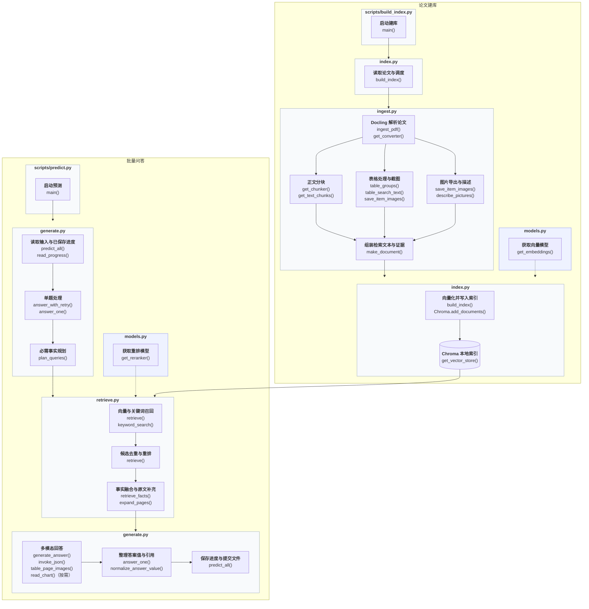

# WattBot 2026：多模态 RAG 参赛方案

本项目面向 [Kaggle WattBot 2026](https://www.kaggle.com/competitions/WattBot2026/overview)，从指定论文与报告的正文、表格和图表中检索证据，生成包含答案值、引用、支持材料和解释的提交 CSV。

## 比赛背景

WattBot 2026 关注人工智能的能源消耗、用水、碳排放及其他环境影响。参赛系统需要回答直接事实、图表读数、数学推导、跨文献组合和冲突消解等问题；语料不足以支持答案时，应明确拒答。任务介绍见 [UW–Madison 官方项目页](https://uw-madison-datascience.github.io/ML-X-Nexus/Projects/ML-Marathon/WattBot-2026.html)。

当前使用的数据包包含 122 份文献索引、245 道训练题和 317 道测试题。仓库 `input/` 中的文件由比赛提供，来源为 [WattBot 2026 官方数据页面](https://www.kaggle.com/competitions/WattBot2026/data)。文献由 `metadata.csv` 给出下载链接，参赛者需要准备对应 PDF。

比赛采用 0～1 的 WattBot Score：

| 评分项 | 权重 | 关注内容 |
|---|---:|---|
| `answer_value` | 75% | 数值、类别或不可回答状态是否正确 |
| `ref_id` | 20% | 支持文献集合与标准引用集合的 F1 |
| `is_NA` | 5% | 不可回答题是否正确拒答并清空证据字段 |

数值答案通常按 ±0.1% 相对容差判断，部分题目有单独的容忍范围；具体规则以数据包中的官方 `Score.py` 为准。`answer_unit` 由问题文件提供，不单独计分。不可回答时，`answer_value`、`ref_id`、`ref_url` 和 `supporting_materials` 使用 `is_blank`。

## 项目架构

项目由论文建库和批量问答两条流程组成，两者共享 Chroma 索引。

### 处理流程

实线：处理流程；虚线：模型支持调用。



缺少事实时最多补查一轮；图表按需独立读取。预测使用已有索引，原文补充和页面渲染直接读取论文。

### 功能与实现

#### 模型与图片工具

实现文件：[models.py](src/wattbot/models.py)。

| 功能 | 主要函数 | 当前实现 |
|---|---|---|
| 文本向量 | `get_embeddings()` | `BAAI/bge-small-en-v1.5`，向量归一化；优先使用图形处理器（GPU），CUDA 不可用时使用中央处理器（CPU） |
| 候选重排模型 | `get_reranker()` | `BAAI/bge-reranker-base`；优先使用图形处理器（GPU），CUDA 不可用时使用中央处理器（CPU） |
| 大模型选择 | `get_llm()` | 默认深度求索（DeepSeek）`deepseek-flash`，可选 MiMo `mimo-v2.6-flash`；默认关闭思考 |
| 原页与图片工具 | `page_image()`、`image_block()` | 按需渲染完整原页并缓存，将图片编码为多模态消息 |

模型客户端、向量模型和重排模型按需加载，在同一进程中复用。

#### 论文解析与证据准备

实现文件：[ingest.py](src/wattbot/ingest.py)。

| 功能 | 主要函数 | 当前实现 |
|---|---|---|
| 论文解析 | `get_converter()`、`ingest_pdf()` | Docling 提取正文、表格与图片；默认关闭光学字符识别（OCR） |
| 正文分块 | `get_chunker()`、`get_text_chunks()` | 按章节和图表边界组织正文，合并同章节短块并控制长度 |
| 表格与续表处理 | `table_groups()`、`table_search_text()` | 保留列名、单位与行信息，对满足条件的跨页续表归组 |
| 原图导出 | `save_item_images()` | 导出表格与图片截图，保存来源页码和原图路径 |
| 图表检索描述 | `describe_picture()`、`describe_pictures()` | 结合图题与相关正文描述图片；异常表格按截图转写，生成检索文字 |
| 图像筛选与描述复用 | `inspect_picture()`、`describe_pictures()` | 空白图不调用描述模型，精确重复图复用描述，优先使用缓存，未缓存图片并发处理 |
| 上下文与脚注 | `element_contexts()`、`element_notes()` | 为图表补充章节及相关原文；已识别脚注保留来源并独立入库 |
| 证据记录封装 | `make_document()` | 将检索文本和原始证据组装成文档对象（Document），保存来源、页码与图片路径 |

#### 索引管理

实现文件：[index.py](src/wattbot/index.py)。

| 功能 | 主要函数 | 当前实现 |
|---|---|---|
| 本地持久化索引 | `get_vector_store()` | Chroma 统一索引正文、表格文本和图片描述，保存原始证据元数据 |
| 按论文更新 | `build_index()` | 解析完成后替换该论文的旧记录，分批写入新记录 |

#### 混合检索

实现文件：[retrieve.py](src/wattbot/retrieve.py)。

| 功能 | 主要函数 | 当前实现 |
|---|---|---|
| 向量召回 | `retrieve()` | 根据查询语义检索，常规查询最多召回 60 条候选 |
| 关键词与短语召回 | `keyword_search()` | 使用全文检索模块（FTS5）与 BM25 排序，常规查询最多召回 60 条候选 |
| 名称与型号匹配 | `entity_pattern()` | 兼容名称中的空格和连字符，区分型号前缀与版本后缀 |
| 候选重排与去重 | `retrieve()` | 合并两路候选，使用 BGE 重排，再按证据标识去重 |
| 多事实证据融合 | `retrieve_facts()` | 使用倒数排名融合（RRF），兼顾各事实覆盖；首轮选取最多 10 份检索证据 |
| 原文上下文补充 | `expand_pages()` | 补充相关页、论文首页与邻近正文，恢复实验条件等上下文 |

#### 多模态回答与引用

实现文件：[generate.py](src/wattbot/generate.py)。

| 功能 | 主要函数 | 当前实现 |
|---|---|---|
| 事实规划与查询改写 | `plan_queries()` | 保留原问题，拆分必需事实，并生成检索改写 |
| 结构化多模态回答 | `generate_answer()`、`invoke_json()` | 结合原文、表格原页与图片，使用 Pydantic 整理答案值、引用、支持材料和解释 |
| 表格原页与独立读图 | `table_page_images()`、`read_chart()` | 表格优先附完整原页，必要时逐图读取数值及其条件 |
| 缺失事实补查 | `answer_one()` | 根据答案草稿最多补查一轮，可在已命中文献内检索 |
| 无答案处理 | `blank_answer()`、`answer_one()` | 无可用证据或明确拒答时，生成比赛要求的 `is_blank` 字段 |
| 支持材料与引用来源 | `verify_supports()`、`answer_one()` | 将支持材料关联到证据标识，并从官方元数据生成引用链接 |
| 答案值格式整理 | `normalize_answer_value()` | 整理真假值与显式数值范围，保留模型给出的数值精度 |

#### 批量运行与评分

主要实现文件：[generate.py](src/wattbot/generate.py)；官方评分文件：[input/Score.py](input/Score.py)。

| 功能 | 主要函数 | 当前实现 |
|---|---|---|
| 并发问答 | `generate.predict_all()` | 最多并发处理 3 题，共享的本地检索与重排串行执行 |
| 断点恢复与重新预测 | `generate.read_progress()` | 恢复问题和单位匹配的成功结果；使用 `--restart` 开始新一轮预测 |
| 请求与输出异常重试 | `generate.answer_with_retry()`、`generate.invoke_json()` | 内容过滤和结构化输出截断按对应分支重试，相关失败题记录到 `.failed.csv` |
| 进度保存与结果导出 | `generate.predict_all()` | 逐题写入进度，全部完成后按输入顺序更新提交文件，保留原输入列 |
| 官方本地评分 | `Score.score()` | 使用比赛提供的答案值、引用 F1 与拒答评分规则；独立于预测流程 |

模块间通过文档对象（Document）、证据字典和答案草稿传递数据：`page_content` 保存检索文本，`metadata` 保存原始证据、来源、页码和图片路径。

## 方案作用

项目将逐篇查找文献、整理证据和填写答案的过程串成可重复运行的流程，用于完成比赛提交，也可通过自定义问题文件查询同一文献集。

比赛要求把答案与指定文献中的证据对应起来。检索提供可追溯的来源，多模态输入帮助读取正文解析无法完整表达的图表信息，结构化输出则将结果转换为比赛需要的字段。

| 比赛需求 | 项目做法与作用 |
|---|---|
| 证据分散在正文、表格和图片中 | Docling 保留文档结构；图表通过文本表示参与检索，命中后提供原图，便于读取表头、图例和数值 |
| 问题同时包含语义描述与精确型号、术语 | 向量检索覆盖语义相近内容，关键词检索补充名称和短语匹配，降低单一召回方式的遗漏风险 |
| 跨文献问题需要多个事实 | 先规划必需事实，再分别检索并融合证据，使不同操作数或来源都有机会进入回答上下文 |
| 召回内容多，相关程度不同 | BGE 重排与证据去重集中保留相关材料，减少重复上下文 |
| 答案需要可核查的引用和解释 | 保存原始证据、页码和来源映射，将支持材料及推理写入提交文件 |
| 整批预测需要稳定完成 | 本地模型和索引复用，逐题保存进度，支持中断后继续 |

## 运行方法

### 1. 安装环境

需要 Python 3.14 或以上版本和 uv。可用的 NVIDIA 图形处理器（GPU）用于 CUDA 加速；没有可用 CUDA 时自动使用中央处理器（CPU）。以下命令以 Windows PowerShell 为例：

```powershell
git clone https://github.com/DeianHsu/WattBot.git
cd WattBot
uv sync
.venv\Scripts\Activate.ps1
python -c "import torch; print(torch.__version__, torch.cuda.is_available())"
```

最后一条命令显示 PyTorch 版本和 CUDA 可用状态：`True` 时本地向量模型与重排模型使用图形处理器（GPU），`False` 时自动使用中央处理器（CPU），运行速度会较慢。Windows 环境按项目配置安装 CUDA 13.0 版 PyTorch。

`pyproject.toml` 声明项目和依赖范围，`uv.lock` 固定依赖版本；`uv sync` 读取二者并建立项目 `.venv` 环境。

### 2. 配置大模型 API

`.env.example` 提供配置模板，首次使用时复制为项目根目录的 `.env`：

```powershell
Copy-Item .env.example .env
```

项目默认使用 DeepSeek，并关闭思考模式。编辑 `.env`，填写 `DEEPSEEK_API_KEY`：

```dotenv
LLM_PROVIDER=deepseek
ANSWER_REASONING_EFFORT=off
MIMO_API_KEY=
DEEPSEEK_API_KEY=你的密钥
```

`ANSWER_REASONING_EFFORT=off` 保持关闭思考。使用 MiMo 时，将 `LLM_PROVIDER` 设为 `mimo`，填写 `MIMO_API_KEY`。图片描述、异常表格转写、事实规划和问答会调用所选 API。

`models.py` 读取 `.env` 和环境变量来选择供应商、创建客户端；`generate.py` 读取最终回答的思考模式配置。

### 3. 准备比赛数据与论文

仓库已包含比赛提供的 `input/` 文件，可直接使用。文件来源及更新见 [WattBot 2026 官方数据页面](https://www.kaggle.com/competitions/WattBot2026/data)：

| 文件 | 用途与使用方 |
|---|---|
| `metadata.csv` | 提供文献 ID、元数据及固定下载 URL；`generate.py` 用于核对引用 ID 和填入引用链接 |
| `test_Q.csv` | 提供测试问题和预期答案单位；由 `generate.predict_all()` 默认读取 |
| `train_QA.csv` | 提供带答案、引用和证据的训练示例；可通过 `--input` 生成预测，或作为本地评分的标准答案 |
| `Score.py` | 比赛提供的独立评分工具，预测流程不调用它 |
| `CONTRIBUTE_QUESTIONS.md` | 官方问题贡献说明，供参赛者阅读 |
| `WRITEUP_TEMPLATE.md` | 官方参赛报告模板，供参赛者填写 |

另行按 `metadata.csv` 的固定 URL 下载论文，保留指定版本，并以 `<id>.pdf` 命名。

`papers/` 中的 PDF 在建库时由 `ingest.py` 解析；预测时，`retrieve.py` 可从中补充页面原文，`models.py` 可按需渲染表格原页。

本地目录示例：

```text
WattBot/
├─ input/
│  ├─ metadata.csv
│  ├─ test_Q.csv
│  ├─ train_QA.csv
│  ├─ Score.py
│  ├─ CONTRIBUTE_QUESTIONS.md
│  └─ WRITEUP_TEMPLATE.md
├─ papers/
│  └─ <metadata 中的 id>.pdf
├─ scripts/
├─ src/wattbot/
├─ .env
├─ pyproject.toml
└─ uv.lock
```

论文、密钥、索引和生成结果需在本地准备或生成。

### 4. 建立索引

```powershell
# 处理 papers/ 中的全部 PDF
python scripts/build_index.py

# 只处理一篇论文
python scripts/build_index.py --pdf "papers/实际论文文件名.pdf"
```

首次运行会下载所需本地模型。`index.py` 将向量索引写入 `chroma_db/`，供预测阶段打开和检索；`ingest.py` 将截图和描述缓存写入 `artifacts/`，`models.py` 也在该目录缓存按需渲染的原页。问答阶段通过图片工具读取这些文件并附入模型请求。重新处理单篇论文会替换该论文的索引记录。

### 5. 生成并提交答案

```powershell
python scripts/predict.py
```

入口调用 `generate.predict_all()`，默认读取 `input/test_Q.csv` 和 `input/metadata.csv`，将结果写入 `submissions/test_submission.csv`，完成后可将该 CSV 提交到 Kaggle。

输出保留题号、原问题和预期单位，并填入以下字段：

| 字段 | 内容 |
|---|---|
| `answer` | 自然语言回答 |
| `answer_value` | 标准化数值、类别或 `is_blank` |
| `ref_id`、`ref_url` | 支持文献 ID 与链接 |
| `supporting_materials` | 原文引语、表格或图表证据 |
| `explanation` | 证据如何支持答案，以及必要的计算过程 |

### 6. 自定义输入与恢复运行

```powershell
# 自定义问题文件和输出位置
python scripts/predict.py --input input/questions.csv --output submissions/answers.csv

# 模型、提示词或索引改变后重新预测
python scripts/predict.py --restart
```

自定义问题 CSV 需要 `id`、`question` 和 `answer_unit` 字段，文献元数据仍从 `input/metadata.csv` 读取。

`generate.py` 为每个输出路径保存同名 `.progress.jsonl`，由 `read_progress()` 恢复成功结果。中断后重跑相同命令即可继续；新一轮首次启动使用 `--restart`，续跑时去掉该参数。部分题目失败时，程序保存成功进度并写入 `.failed.csv`；全部题目完成后才更新最终提交文件。
